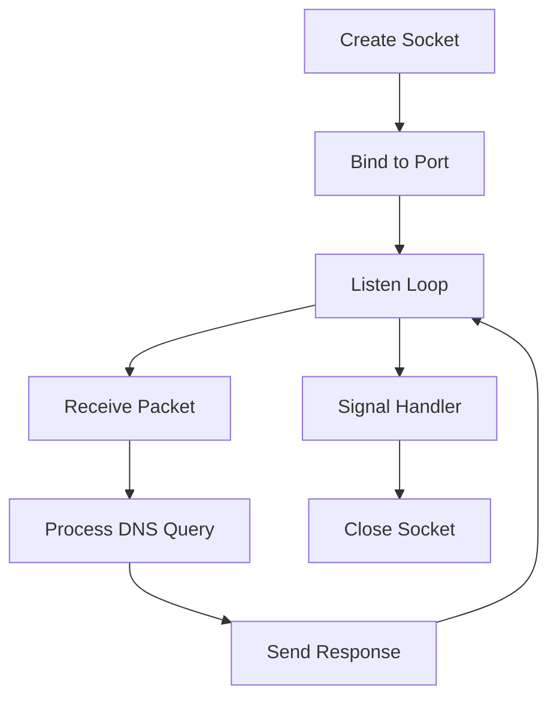

# UDP in DNS Server Architecture

## UDP Socket Lifecycle



## UDP vs TCP Characteristics

| Aspect | UDP | TCP | DNS Usage |
|--------|-----|-----|-----------|
| **Connection** | Connectionless | Connection-oriented | UDP for queries < 512 bytes |
| **Reliability** | No guarantees | Reliable delivery | DNS handles retries at app level |
| **Overhead** | Low | Higher | Perfect for fast DNS lookups |
| **State** | Stateless | Stateful | Each DNS query is independent |

## DNS Server UDP Flow

```
┌─────────────────────────────────────────────────────────────┐
│                    DNS SERVER PROCESS                       │
├─────────────────────────────────────────────────────────────┤
│  1. socket(AF_INET, SOCK_DGRAM, 0)                          │
│     └── Creates UDP socket file descriptor                  │
│                                                             │
│  2. bind(socket_fd, &addr, sizeof(addr))                    │
│     └── Binds socket to port 53 (or custom port)            │
│                                                             │
│  3. recvfrom(socket_fd, buffer, size, 0, &client, &len)     │
│     └── Blocks waiting for DNS queries                      │
│                                                             │
│  4. Process DNS packet (parse → lookup → build response)    │
│                                                             │
│  5. sendto(socket_fd, response, size, 0, &client, len)      │
│     └── Send response back to same client                   │
│                                                             │
│  6. Loop back to step 3                                     │
└─────────────────────────────────────────────────────────────┘
```

## Packet Flow Example

```
Client (192.168.1.100:54321)          DNS Server (0.0.0.0:53)
         │                                       │
         │ UDP Query: "www.example.com A?"       │
         ├──────────────────────────────────────►│
         │                                       │ ┌─ Parse query
         │                                       │ ├─ Lookup in trie
         │                                       │ └─ Build response
         │                                       │
         │ UDP Response: "192.168.1.2"           │
         │◄──────────────────────────────────────┤
         │                                       │
```
